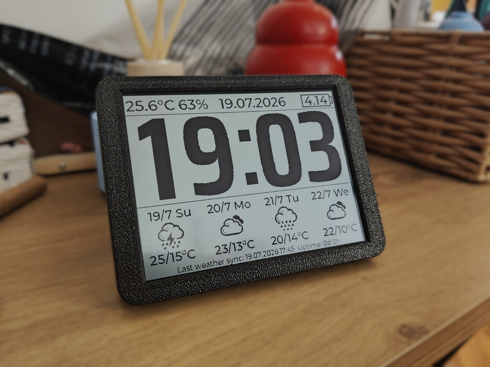

# ESP32-S3 RLCD Weather Clock

A simple desk clock built around the [Waveshare ESP32-S3-RLCD-4.2](https://www.waveshare.com/esp32-s3-rlcd-4.2.htm) — a 4.2" reflective LCD (e-paper-like) development board.

The project was written from scratch in **VS Code with ESP-IDF**, with help from AI along the way. I really don't like working in the Arduino environment, so ESP-IDF + VS Code was the natural choice here.

## Features

- Time and date on a low-power reflective display
- Indoor temperature and humidity from the onboard SHTC3 sensor (top-left corner of the screen) — being an onboard sensor, it sits close to the electronics, so readings are only approximate, not lab-grade
- 4-day weather forecast fetched over Wi-Fi (Open-Meteo)
- Battery voltage / percentage indicator
- RTC-based timekeeping (PCF85063) that survives power loss

## Setup

Before flashing, edit the config headers under `components/clock/` with your own details:

- `clock_config.h` — your Wi-Fi SSID and password
- `weather_config.h` — your location (latitude / longitude) for the weather forecast

## Controls

| Button | Action |
|---|---|
| Left   | Force an immediate weather update |
| Middle | Long press: power off · Short press: power back on |
| Right  | Not used |

## How it works

The clock spends most of its time in **light sleep** to save power. It wakes up once a minute to refresh the time from the internal RTC. Twice a day, at **05:00** and **15:00**, it connects to Wi-Fi to sync the RTC with NTP and fetch an updated weather forecast at the same time.

## ⚠️ Battery life

This module is **not particularly battery-friendly**. With the screen on, it draws around **8 mA even in light sleep**, which works out to roughly **14 days** of runtime on a single charge. Keep that in mind if you're planning to run it purely on battery.

## Hardware

- [Waveshare ESP32-S3-RLCD-4.2](https://www.waveshare.com/esp32-s3-rlcd-4.2.htm)
