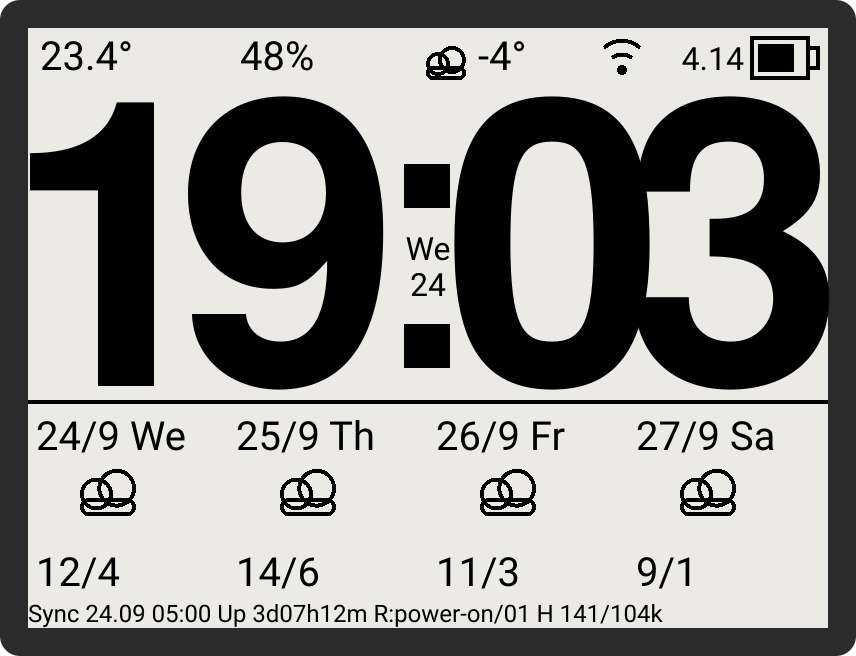

# ESP32-S3 RLCD Weather Clock

A simple desk clock built around the [Waveshare ESP32-S3-RLCD-4.2](https://www.waveshare.com/esp32-s3-rlcd-4.2.htm) — a 4.2" reflective LCD (e-paper-like) development board.

The project was written from scratch in **VS Code with ESP-IDF**, with help from AI along the way. I really don't like working in the Arduino environment, so ESP-IDF + VS Code was the natural choice here.



*A simulation of the main screen, not a photograph — generated by
`tools/render_screen_mockup.py`, which reads the layout constants straight out
of `components/ui/`. The real panel is 1-bit with no grey, so its strokes are
harder-edged and its diagonals dither; the fonts here are the viewer's, not the
embedded Saira and Montserrat. It is drawn from the source so it cannot quietly
fall out of date, which is what happened to the photo it replaced.*

## Features

- Time on a low-power reflective display, with the date tucked into the gap between the colon's two dots — the one hole the big digits leave
- Indoor temperature and humidity from the onboard SHTC3 sensor — being an onboard sensor it sits close to the electronics, so readings are approximate, not lab-grade
- Current outdoor conditions and a 4-day forecast over Wi-Fi (Open-Meteo)
- A link indicator that shows what the radio is actually doing: a tick when the last sync worked and the radio is resting, a warning when the data has gone stale, and an aerial only while a connection genuinely exists
- Battery gauge with voltage, and a charging bolt when it is on power
- RTC timekeeping (PCF85063) across resets and reboots

## Setup

Everything configurable lives in menuconfig, under **Weather Clock**:

```
idf.py menuconfig
```

| Submenu | What to set |
|---|---|
| Wi-Fi | SSID and password |
| Time | POSIX timezone string, NTP server, the two daily time-sync hours |
| Weather | Latitude and longitude, refresh interval, stale threshold |
| Battery | Low-battery warning and critical-shutdown thresholds |

Your answers are written to `sdkconfig`, which is **not tracked by git** — it
holds your Wi-Fi password and your location. `sdkconfig.defaults` is tracked and
carries only project-wide settings, so a fresh clone builds with empty
credentials and you set your own.

## Controls

| Button | Action |
|---|---|
| Left   | Force an immediate weather update |
| Middle | Long press: power off · Short press: power back on |
| Right  | Not used |

## How it works

The clock spends most of its time in **light sleep** to save power, waking once a minute to refresh the time from the internal RTC. Twice a day, at **05:00** and **15:00**, it syncs the RTC against NTP. Weather runs on its own shorter cycle - **every 30 minutes** by default - and shares a Wi-Fi bring-up with the time sync whenever the two coincide. All four values are configurable.

While a USB host is attached the clock does not light-sleep at all: light sleep suspends the USB Serial/JTAG peripheral, which would make the serial port disappear. On battery it sleeps as normal.

## ⚠️ Battery life

This module is **not particularly battery-friendly**. With the screen on, it draws around **8 mA even in light sleep**, which works out to roughly **14 days** of runtime on a single charge. Keep that in mind if you're planning to run it purely on battery.

## Keeping time without a backup cell

The PCF85063 has a pin for a backup cell, and **this build has none fitted**.
That is worth knowing because it decides what the clock does when it comes back:

- After a **reset or a panic reboot**, main power never dropped, so the RTC kept
  running and the time is still good.
- After an **unplug**, the oscillator stopped. The chip then returns a perfectly
  well-formed *wrong* time, and the only thing that says so is bit 7 of the
  seconds register — the oscillator-stop flag.

So the firmware reads that flag rather than trusting the value. With no network
and no valid RTC time it shows `--:--` until a sync lands, instead of a
confident and wrong `00:00`. A missed sync is never fatal either: it keeps
running on whatever time it has and retries on the next weather slot.

Fit a backup cell and time survives an unplug too.

## The finished build


*The 3D-printed case. Note that this photo predates the current UI — the top bar
has since been rebuilt and the date moved onto the face.*

## Checking a layout without flashing

A 400px-wide 1-bit panel has no room to be wrong, and the way to get it wrong is
to try a layout with a flattering sample. `Fri 21` fitted the date column; `Wed
24` did not, and only one of those was ever typed in by hand.

```
python tools/verify_calendar_layout.py     # exits non-zero on an overflow
python tools/render_screen_mockup.py       # regenerate the mockup above
```

The checker measures against the **real** LVGL font tables — it parses the
`adv_w` values out of the generated font C files, including the sparse ranges
where `°` and the `LV_SYMBOL_*` glyphs live — and then tests the widest value
each field can hold rather than a typical one. Run it after touching anything in
`components/ui/`.

`TODO.md` carries the open leads, including a measurement that is suggestive but
not yet conclusive.

## Hardware

- [Waveshare ESP32-S3-RLCD-4.2](https://www.waveshare.com/esp32-s3-rlcd-4.2.htm)
